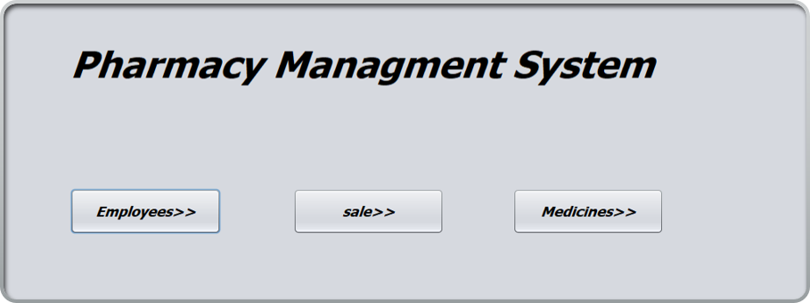
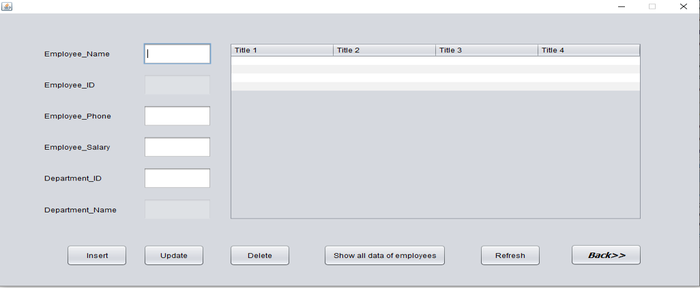
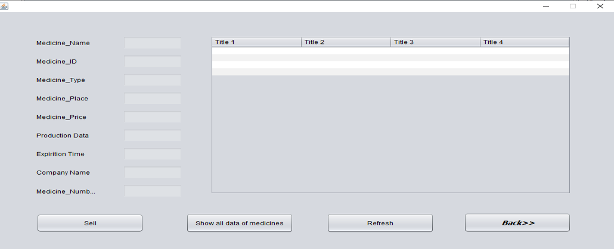
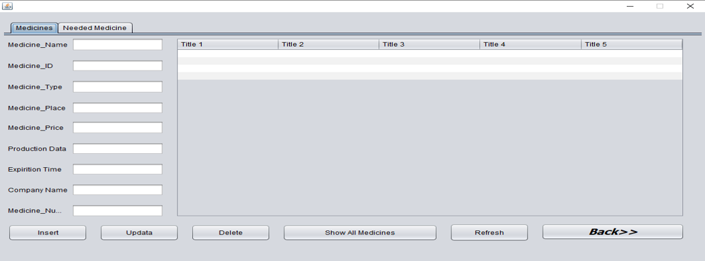
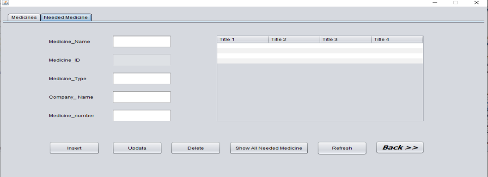
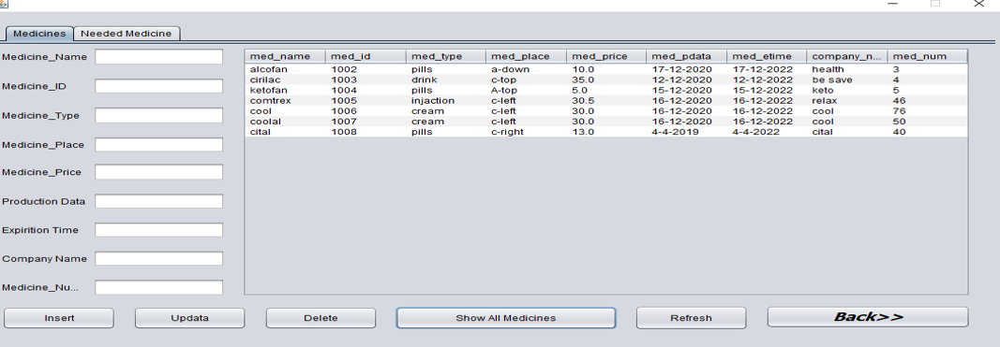
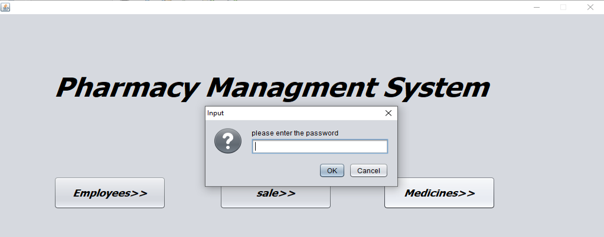

# Pharmacy-management-system

Desktop application for pharmacy management system to manage medications where employees can view, add, edit and delete.

## Features:

- Page contains all medicines.
- Page contains all employee are managed by admin.
- Page for sale medecines.

## Used Technologies

- Java
- MySQL Database
- Netbeans

#### Screenshots

